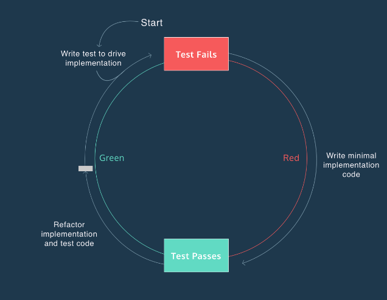

# JavaScript Unit Testing
Learning to write unit tests in JavaScript with Mocha.

- Define an automated test suite

- Describe how a test suite is used in software development

- Explain the benefits of automated testing


Why Test?

LESSON 1

Learn the benefits of software testing and the terminology to explain them.

Exercises

1. Introduction

2. Manual Testing

3. Automated Testing

The workflow might look like this:

- Write code and corresponding tests
- Enter a command into a terminal to run tests
- If the app behaves as intended, all tests should pass. Development is complete.
- If it does not behave as intended, at least one test should fail. Fix code and return to step 2.

4. The Test Suite

5. Tests As Documentation

6. Regression

Automate and Organize Tests

LESSON 2

Use the Mocha framework to automate and organize tests.

Exercises

1. Introduction

Testing is an essential part of development. When used properly, testing can catch and identify issues with your implementation code before you deploy it to users. Instead of testing every function manually, developers automate their tests with a test framework.

2. Install Mocha I

- The following command creates a file package.json that can be used to manage packages for the project.

```sh
$ npm init
```

With your project setup, you can install packages.

```sh
$ npm install mocha -D
```

The new directory structure contains the following:

```sh
project
|_ node_modules
|___ .bin
|___ mocha
|___ ...
|_ package.json
```


3. Install Mocha II

The first (and more tedious) method is to call it directly from node_modules:

```sh
$ ./node_modules/mocha/bin/mocha
```

set the value of "test" to mocha. It should look like this:

```sh
"scripts": {
  "test": "mocha"
}
```
Now you can call Mocha with the following command:

```sh
$ npm test
```
4. describe and it blocks

5. assert

6. Setup, Exercise, and Verify

7. Teardown

8. Hooks


Write Expressive Tests

LESSON 3

Use the Node.js assert library to write more expressive tests.

Exercises

1. Introduction

A good test framework is fast, complete, reliable, isolated, maintainable, and expressive. In this lesson you will learn how to use Node’s assert library to write more expressive tests.

2. assert.ok

- As a Node module, assert can be imported at the top of your files with

```sh
const assert = require('assert');
```

3. assert.equal

4. assert.strictEqual

5. assert.deepEqual I

6. assert.deepEqual II

7. Other assert methods

Read the documentation for [assert.notEqual()](https://nodejs.org/api/assert.html#assert_assert_notequal_actual_expected_message)


Learn TDD With Mocha

LESSON 4

Practice test-driven development to create a JavaScript testing suite using Mocha.js.

Exercises

1. Introduction

- Test-driven development (TDD) is a programming technique where you write test code before implementation code. Test code is written to define the desired behavior of your program.



2. Getting Into The Red I

3. Red To Green I

4. Refactor I

5. Getting into the Red II

6. Red to Green II

- Write a for loop that iterates inputArrayLength number of times and adds the value of each element to totalSum.

```js
 const Calculate = {
	sum(inputArray) {
    
    let totalSum = 0;
    const inputArrayLength = inputArray.length;
		for (let i = 0; i < inputArrayLength; i++){
      totalSum += inputArray[i]
    }
    return totalSum
	}
}

module.exports = Calculate;
```

7. Refactor II

- Refactor the code in your index.js file by replacing the current implementation code inside Calculate.sum() with a function that uses the built-in JavaScript method .reduce() to accumulate the total value of an array of numbers.

```js
const Calculate = {
  sum(inputArray) {

    return inputArray.reduce((sum, value) => {
      return sum + value;
      if (inputArray.length === 0) {
        return 0;
      }
    })
  }
}

module.exports = Calculate;
```


8. Edge Case